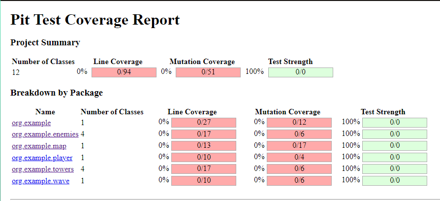

# Tower Defense

`src.main.java.org.example` código de produccion dividido en carpetas

`src.test.java.org.example` código de test dividido en carpetas

## Consideraciones
Se considera que el camino es en línea recta y único.

Se considera que los enemigos hacen la misma cantidad de daño.

Se considera  que las torres no pueden colocarse en los caminos('C').

Se considera que los enemigos avanzan uno por uno, si llegan a la base se actualizará 
el estado de la base y el enemigo desaparecerá para proseguir con el siguiente enemigo.

## Explicación del código

### Enemigos
`org.example.enemies` tenemos 3 tipos de enemigos `BasicEnemy`, `FastEnemy`, `BossEnemy`
y tenemos una interfaz `EnemyFactory` la cual es implementada por las clases
`BasicEnemyFactory`, `FastEnemyFactory`, `BossEnemyFactory` para la creación de enemigos.
```java
public interface EnemyFactory {
    Enemy createEnemy();
}
```
Uso: Se implementa la interfaz `EnemyFactory` para la creación del enemigo `BossEnemyFactory`, 
este tiene las caracteristicas: lento, mucha vida, mayor recompensa.
```java
public class BossEnemyFactory implements EnemyFactory{
    @Override
    public Enemy createEnemy() {
        return new Enemy(1, 500, 50);
    }
}
```

### Torres
`org.example.towers` tenemos 3 tipos de torres `ArrowTower`, `LaserTower`, `CannonTower`
y tenemos una interfaz `TowerFactory` la cual es implementada por las clases
`ArrowTowerFactory`, `LaserTowerFactory`, `CannonTowerFactory` para la creación de torres.
```java
public interface TowerFactory {
    Tower createTower();
}
```
Uso: Se implementa la interfaz `TowerFactory` para la creación de la torre `CannonTower`,
esta tiene las caracteristicas: Alto daño, corto alcance.
```java
public class CannonTowerFactory implements TowerFactory{
    @Override
    public Tower createTower() {
        return new CannonTower();
    }
}
```

### Mapa
`org.example.map` es el escenario donde se desarrolla el juego. Está representado por una matriz
 que define los caminos por los que se moverán los enemigos y las posiciones donde se pueden colocar las torres.

### Oleadas
`org.example.wave` maneja las oleadas de enemigos.

### Jugador
`org.example.player` rRepresenta al jugador y sus estadísticas.

### Game
`org.example` clase principal que maneja la lógica del juego.

## Implementación de pruebas

Antes de implementar cualquier tipo de pruebas generaré un reporte por Pitest para verificar cuantos
mutantes tenemos que matar.



Verificamos que en la columna Mutation Coverage tenemos en total 51 mutantes que han sobrevivido, esto es 
porque aún nose generó ninguna prueba.

### Pruebas de mutación

**Implementa pruebas de mutación para verificar la calidad de las pruebas unitarias.**

Ejemplo: Clase `Wave`

Este test se implementó con la finalidad que en la primera oleada solo se generen enemigos del tipo `BasicEnemy`
```java
@Test
public void testGenerateEnemies_BasicEnemiesCount() {
    basicEnemyFactory = new BasicEnemyFactory();
    bossEnemyFactory = new BossEnemyFactory();
    wave = new Wave(1, basicEnemyFactory, bossEnemyFactory); // Inicializar con la oleada 1
    List<Enemy> enemies = wave.getEnemies();
    // Verificar que se generan 5 enemigos para la oleada 1
    assertEquals(5, enemies.size());
}
```

Una vez implementadas algunas pruebas el reporte de Pitest se de la siguiente manera:


Ahora tenemos una cobertura del 65%, hemos matado el 65% de los mutantes generados por Pitest.
Y una cobertura de linea del 67%.

Nota: no se han generado test para los métodos void, es por eso que en el paquete `org.example.map` 
no tenemos una cobertura del 100%.

**¿Qué herramienta utilizarías para realizar pruebas de mutación en este proyecto, y cómo la
configurarías?**

Para realizar pruebas de mutación en este proyecto, utilicé Pitest (PIT Mutation Testing).Pitest es una herramienta de 
pruebas de mutación que se utiliza para evaluar la efectividad de un conjunto de pruebas, introduciendo cambios (mutaciones) 
en el código fuente y verificando si las pruebas detectan estos cambios.

**Configura la herramienta de pruebas de mutación para el proyecto y ejecuta un análisis de
mutación en la clase TowerDefenseGame.**

Configuracion de PItest
1. En plugins insertar el siguiente id
```groovy
plugins {
 id 'info.solidsoft.pitest' version '1.15.0'
}
```
2. En dependencies agregar las siguientes dependencias
```groovy
dependencies {
    pitest 'org.pitest:pitest-junit5-plugin:1.1.0'
    pitest 'org.pitest:pitest-junit5-plugin:1.1.0'
}
```
3. Finalmente agregar
```groovy
pitest {
    targetClasses = ['org.example.*'] // Paquete de clases a mutar
    excludedMethods = ['void .*'] // Excluir métodos void
    mutators = ['DEFAULTS'] // Conjunto de mutadores [OLD_DEFAULTS, DEFAULTS, STRONGER, ALL]
    outputFormats = ['HTML'] // Formato de salida del informe
    timestampedReports = false // Deshabilitar informes con marca de tiempo para facilitar la navegación
}
```

Ejecutando PItest para la clase `TowerDefenseGame`


En un principio tenemos una cobertura del 0% tanto en cobertura de linea y cobertura de mutaciones.
Procederemos a implementar test para aumentar la cobertura, tomando en cuenta que al método `main()`
no se le hará pruebas.


Ahora hemos aumentado la cobertura en un 17% para la cobertura de mutacion, hay que tener en cuenta
que el metodo main no tiene pruebas y que actualmente la clase `TowerDefenseGame` solo tiene getters.

### Evaluación de cobertura de pruebas

**¿Cómo interpretarías los resultados de las pruebas de mutación y qué acciones tomarías
para mejorar la cobertura de las pruebas?**

Para interpretar los resultados de las pruebas de mutación, primero revisé el reporte generado por Pitest. En este 
reporte, identifiqué las mutaciones que sobrevivieron y aquellas que fueron asesinadas, en primera instancia todas las mutaciones
sobrevivieron debido a la falta de pruebas.

Para mejorar la cobertura de pruebas:

1. Refactorizar Código Complejo: Simplificar el código complejo en métodos más pequeños y más probables, y aislar dependencias utilizando inyección de dependencias.
2. Mejorar Pruebas Existentes: Añadir casos de prueba adicionales para cubrir condiciones y ramas no probadas, empleando técnicas como mocks y stubs para simular comportamientos de dependencias.
3. Agregar Pruebas para Métodos void: Aunque los métodos void no devuelven valores, es crucial probar sus efectos secundarios y comportamientos.
4. Agregar Pruebas para el Método main: Tradicionalmente, el método main no se prueba porque se considera solo un punto de entrada.

**Implementa mejoras en las pruebas unitarias basándote en los resultados de las pruebas de
mutación y explica las razones de cada cambio.**

A lo largo de las preguntas anteriores se implementó las mejoras para las pruebas unitarias, comenzando desde tener una cobertura del 0%
hasta llegar a una cobertura del 65%.

## Preguntas de diseño e implementación

### Diseño de la clase Map

**¿Cómo implementarías la clase Map para representar el mapa del juego, asegurando que se
puedan agregar y verificar posiciones de torres y caminos?**

Primero definimos un constructor el cual al crear un objeto Map definirá cual es el camino que seguiran los enemigos y el
lugar donde se encuentra la base.

```java
public Map() {
        // Inicializa el mapa con un diseño predefinido de 5x5
        mapa = new char[][]{
            {' ', ' ', ' ', ' ', 'B'},
            {' ', ' ', ' ', 'C', ' '},
            {' ', ' ', 'C', ' ', ' '},
            {' ', 'C', ' ', ' ', ' '},
            {'C', ' ', ' ', ' ', ' '}
        };
}
```
Creamos los métodos:
```java
public void mostrarMapa()
```
```java
public boolean colocarTorre(int fila, int columna)
```
```java
public boolean esCamino(int fila, int columna)
```
```java
public boolean removerTorre(int fila, int columna)
```

**Implementa un método en la clase Map llamado isValidPosition(int x, int y) que verifique si
una posición es válida para colocar una torre.**

El método isValidPosition() nos permitirá saber si se puede agregar una torre en una posicion específica,
debemos tener en cuenta que las torres solo se pueden agregar en posiciones vacías(' ') . El método primero verifica
que la fila(x) y columna(y) ingreda como argumento estén dentro de los límites del mapa y luego verificamos si la posición
donde queremos poner una torre está vacía.
```java
public boolean isValidPosition(int x, int y) {
        // Verifica si la posición está dentro de los límites del mapa
        if (x >= 0 && x < mapa.length && y >= 0 && y < mapa.length) {
            // Verifica si la posición está vacía
            return mapa[x][y] == ' ';
        }
        return false;
}
```

### Enemigos con diferentes características

**Diseña e implementa una clase SpeedyEnemy que herede de Enemy y tenga una velocidad
mayor pero menos vida.**

Clase `SpeedyEnemy` esta hereda de `Enemy` y tiene una velocidad  mayor pero menos vida.
```java
public class SpeedyEnemy extends Enemy {
 public SpeedyEnemy() {
  super(3, 50, 40); // velocidad, vida, recompensa
 }
}
```

**¿Cómo gestionarías el movimiento de los enemigos en el mapa, asegurando que sigan el
camino predefinido?**

1. Vamos a crear un método `colocarEnemigo()` dentro de la clase `Map`, esta se encargará de colocar el enemigo 'E' en
una posición establecida, además de que simulará el avance del enemigo reemplazando la casilla anterior con 'C'.
```java
public boolean colocarEnemigo(int fila, int columna){
    if (esCamino(fila, columna)){
        mapa[fila][columna] = 'E';
        if (fila+1 >= 0 && fila+1 < mapa.length && columna-1 >= 0 && columna-1 < mapa.length){
            mapa[fila+1][columna-1] = 'C';
        }
        return true;
    }
    return false;
}
```
2. Ahora creamos el método `moveEnemies()` en la clase `Wave` que se encargará de realizar el movimiento del enemigo
a lo largo del mapa comenzando en la posicion (4,0) y terminando en la posicion (2,3) la cual es una antes de la base.

```java
public void moveEnemies(Enemy enemy, Map map){
        //ponemos el enemigo en la casilla 4,0
        int x = 4;
        int y = 0;
        do {
            if (map.colocarEnemigo(x, y)){
                map.mostrarMapa();
                System.out.println("********************");
            }else {
                break;
            }
            x--;
            y++;
        }while (true);
}
```

La siguiente imagen muestra como se vería en consola


### Torres con diferentes habilidades

**Implementa una clase `SniperTower` que tenga un daño alto y un alcance muy largo pero una
velocidad de disparo baja.**

Clase `SniperTower` esta hereda de `Tower`, tiene un daño alto y un alcance muy largo pero una velocidad de disparo baja.
```java
public class SniperTower extends Tower {
    public SniperTower() {
        super(100, 10, 5); // daño, alcance, velocidad de disparo
    }
}
```

**¿Cómo implementarías el método attack(List\<Enemy> enemies) en la clase Tower para
atacar a los enemigos dentro de su alcance?**

Antes de explicar la implemetación del método debo decir que modifiqué el método attack(Enemy enemies) para que resiva
como argumento un solo enemigo, ya que consideré que los enemigos avanzan uno por uno. Por ejemplo
en la primera oleada tenemos 5 enemigos `BasicEnemy` entonces primero pasará el primer enemigo, luego el segundo
y así hasta que pasen los 5, al finalizar esta oleada se mostrarán los puntos y la vida de la base.

También las clases `Enemy` y `Tower` tendrán dos atributos `posX` y `posY` los cuales hacen referencia a la ubicación de 
cada uno en el mapa.

El método attack() calcula la distancia entre el enemigo y la torre, luego verifica que esa distancia sea menor o igual
al alcande la torre para poder atacar, si la distancia es menor o igual se resta el daño de la torre a la vida del enemigo.
```java
public void attack(Enemy enemies){
        double length = Math.sqrt(Math.pow(Math.abs(enemies.getPosX()-getPosX()), 2)+Math.pow(Math.abs(enemies.getPosY()-getPosY()), 2));
        if (length <= getRange()){
            enemies.setHealth(enemies.getHealth() - getDamage());
        }
}
```
### Sistema de oleadas

**¿Cómo diseñarías la generación de oleadas para que cada oleada sea progresivamente más
difícil?**

Para generar oleadas más dificiles progresivamente podemos hacer uso del número de oleada, por ejemplo
en lo que se brindó tenemos que en la quinta oleada se generará un jefe, osea aparte de los enemigos basicos
generados se genera un enemigo boss.

También podemos generar después de la quinta oleada enemigos más rápidos(`FastEnemy`) junto con los enemigos 
básicos (`BasicEnemy`).

**Implementa un método en la clase Wave llamado spawnEnemies() que genere los enemigos
de la oleada y los coloque en el mapa.**

El método `spawnEnemies()` solo se encargará de generar los enemigos.

```java
public void  spawnEnemies(){
        this.enemies = generateEnemies(waveNumber);
}
```

### Sistema de puntuación y salud de la base

**¿Cómo actualizarías la puntuación del jugador y la salud de la base cuando un enemigo es
derrotado o alcanza la base?**

Definimos el método `updateScoreAndHealth(Enemy enemy, boolean defeated)` el cual resivirá como argumentos el Enemy y un booleano
el cual nos ayudará a verificar si el enemigo fue derrotado o no, si el enemigo fue derrotado defeated es `true` y se sumarán los
puntos del enemigo al `score` del jugador, si no se restará en 10 la vida de la base.

**Implementa un método en la clase Player llamado updateScoreAndHealth(Enemy enemy,
boolean defeated).**

Esta es la implementación del método `updateScoreAndHealth()`
```java
public void  updateScoreAndHealth(Enemy enemy, boolean defeated){
        if (defeated){
            addScore(enemy.getReward());
        }else{
            deductBaseHealth(10);
        }

}
```

## Pruebas estructurales

**Cobertura de ramas**

Estas pruebas garantizan que todas las ramas del método `placeTower()` estén cubiertas.
He cambiado el método `placeTower(x, y)` de la clase `Map` para que resiva solamente la posición donde estará una torre, ya que
la clase `Map` solamente trabajará con letras 'C' para el camino, 'B' para la base, 'E' para enemigos y 'T' para torres.
```java
    @Test
    public void testPlaceTower_ValidPosition() {
        // Configurar mock para posición válida
        when(mockMap.isValidPosition(3, 4)).thenReturn(true);
        towerDefenseGame.placeTower(new CannonTowerFactory(), 3, 4);
        // Verificar que la torre se haya colocado
        verify(mockMap).placeTower(eq(3), eq(4));
    }
    @Test
    public void testPlaceTower_InvalidPosition() {
        // Configurar mock para posición inválida
        when(mockMap.isValidPosition(3, 4)).thenReturn(false);
        towerDefenseGame.placeTower(new CannonTowerFactory(), 3, 4);
        // Verificar que la torre no se haya colocado
        verify(mockMap, never()).placeTower(eq(3), eq(4));
    }
```
En el siguiente reporte generado por JaCoCo podemos observar que el método `placeTower()` de la clase `TowerDefenseGame` tiene
una cobertura del 100%, osea la cobertura de ramas está cubierta.


**Cobertura de condiciones**

La implementación de estas pruebas verificarán que todas las condiciones del método `attack()` de la clase `Tower`
estén cubiertas.
Como lo mencioné anteriormente los enemigos pasarán uno a uno hasta llegar o no a la base, es por eso que el método
`attack()` solamente recibe un enemigo a la vez, adicionalmente trabajé con `setPosX()` y `setPosY()` para asignar la posicion
de la torre y enemigo.
```java
    @Test
    public void testAttack_EnemyInRange() {
        List<Enemy> enemies = Arrays.asList(new BasicEnemy());
        enemies.get(0).setPosX(2);
        enemies.get(0).setPosY(2);
        Tower tower = new CannonTower();
        tower.setPosX(2);
        tower.setPosY(1);
        tower.attack(enemies.get(0));
        // Verificar que el enemigo ha recibido daño
        assertEquals(50, enemies.get(0).getHealth());
    }
    @Test
    public void testAttack_EnemyOutOfRange() {
        List<Enemy> enemies = Arrays.asList(new BasicEnemy());
        enemies.get(0).setPosX(5);
        enemies.get(0).setPosY(5);
        Tower tower = new CannonTower();
        tower.setPosX(2);
        tower.setPosY(1);
        tower.attack(enemies.get(0));
        // Verificar que el enemigo no ha recibido daño
        assertEquals(100, enemies.get(0).getHealth());
    }
```

En el siguiente reporte de cobertura generado por JaCoCo observamos que la clase `Tower` tiene una cobertura del 100%,
esto incluye el método `attack()` y por ende la cobertura de condiciones está cubierta al 100%.


## Preguntas de pruebas con Mockito

**¿Cómo usarías Mockito para crear un mock del Map y probar la colocación de torres en la
clase TowerDefenseGame?**

1. Creamos y configuramos la clase de prueba `TowerDefenseGameTest` para poder utilizar mockito.
2. Utilizamos la notación `@Mock` para crear un Mock de la clase `Map`.
3. Utilizamos la notación `@InjectMocks` para inyectar el mock en la instancia de `TowerDefenseGame`
4. Escribimos el test para probar la colocación de torres, configurando el comportamiento del mock

**Implementa un test con Mockito para verificar que el método placeTower solo permite
colocar torres en posiciones válidas del mapa**

El test configura una posición válida en el mapa, intenta colocar una torre en esa posición y luego verifica que la torre fue efectivamente colocada en esa posición.
```java
    @Test
    public void testPlaceTower_ValidPosition() {
        // Configurar mock para posición válida
        when(mockMap.isValidPosition(3, 4)).thenReturn(true);
        towerDefenseGame.placeTower(new CannonTowerFactory(), 3, 4);
        // Verificar que la torre se haya colocado
        verify(mockMap).placeTower(eq(3), eq(4));
    }
```